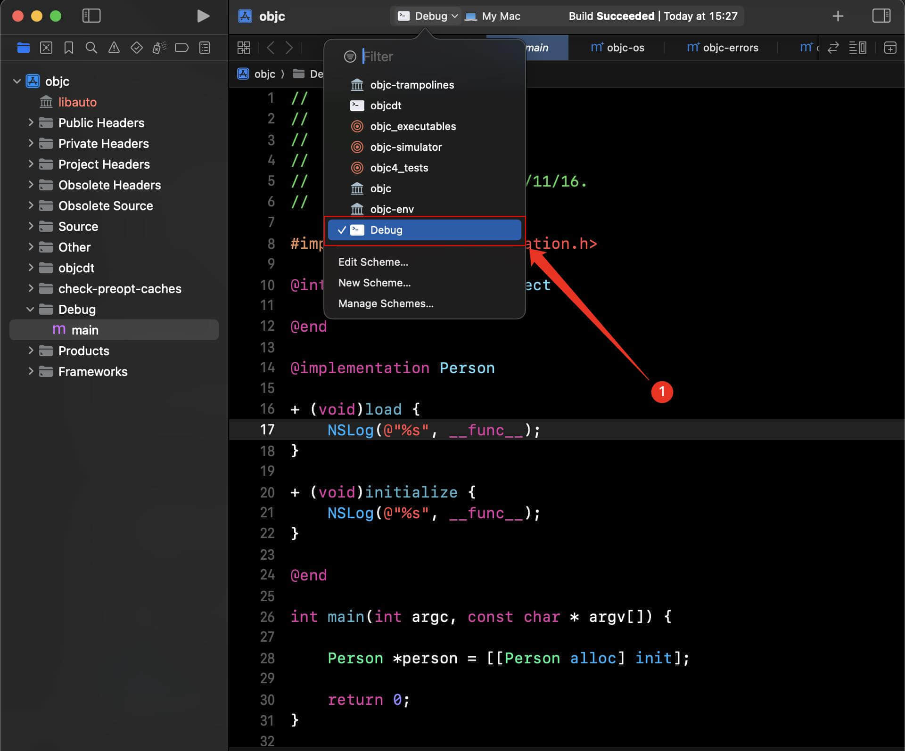
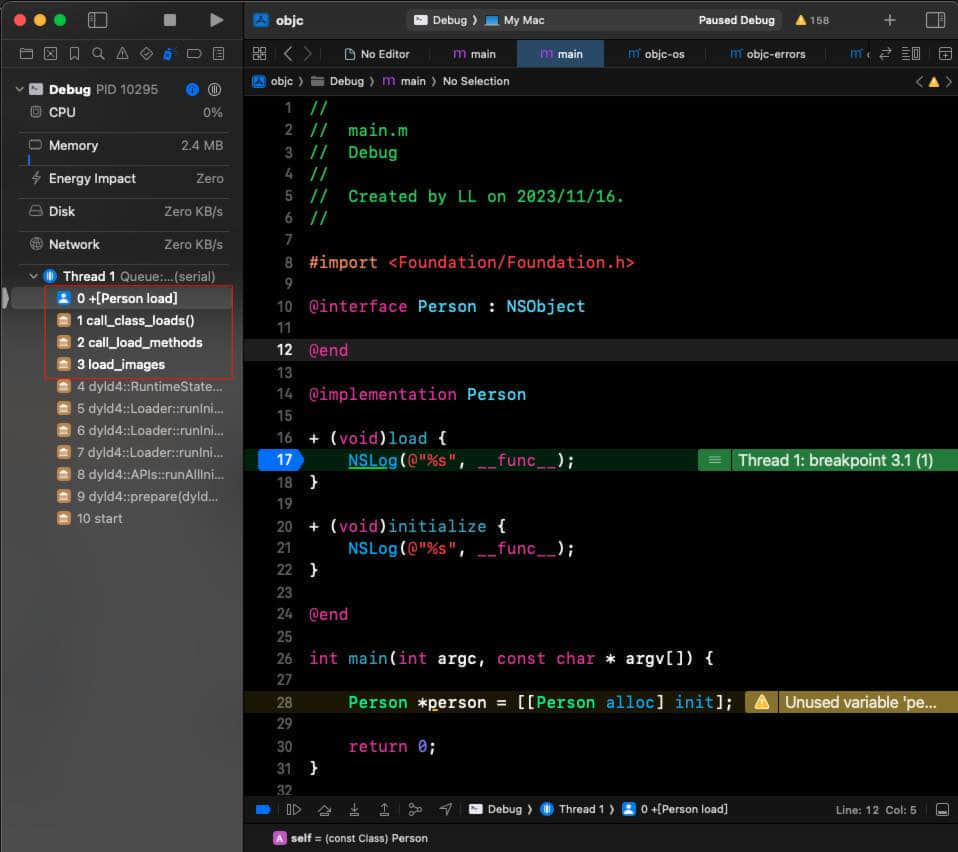

 [](https://gitee.com/internetWei/ObjcRuntimes/blob/main/LICENSE)&nbsp;&nbsp; [](https://internetwei.gitee.io)

不同的 Mac 版本对应的可调试 Runtime 版本可能会不一样，这会导致你从网上下载别人编译调试好的 Runtime 源码在你的电脑上却无法正常调试。

所以，我收集并整理了一些不同版本已经编译调试的 Runtime 源码。

你要做的，就是对照下面的表格，找到你的电脑系统对应的 Runtime 版本，然后下载即可。

| macOS | Runtime 版本 |
|:-:|:-:|
| 14.0 ~ 14.1 | objc4-906 |
| 13.0 ~ 13.5 | objc4-866.9 |
| 12.3 ~< 13.0 | objc4-841.13 |

> ~ 表示左右都包含。例如 13.0 ~ 13.5 表示 13.0 至 13.1 并且包括 13.0 和 13.1。
> 
> ~< 表示仅包含左边的版本。例如 12.3 ~< 13.0 表示 12.3 至 13.0 并且包括 12.3 但不包括 13.0。
> 
> 补充：
> 1. Mac 版本号一般包含三段数字，例如 14.1.1；不用管第3个数字，只需要关心前2个数字，也就是说 14.1.1 正常情况下可以使用 14.1 对应的 Runtime 版本。
> 
> 2. 有时候系统版本与我列出的版本号稍微有点差异也没关系。例如我写的是 objc4-866.9 能在 13.0 ~ 13.5 上运行，但我实际测试发现，在 13.6.1 上也能运行。

由于时间和精力原因，我不可能整理出所有的 Runtime 版本，如果没有你需要的那个版本，请创建一个 [Issues](https://gitee.com/internetWei/ObjcRuntimes/issues/new)，我会尽快处理。

或者，你也可以参考这篇文章自行编译调试：[编译 objc4-866.9 源码](https://juejin.cn/post/7220227713130086459)，编译好后欢迎 [Pull requests](https://gitee.com/internetWei/ObjcRuntimes/pulls)，这可以帮助到更多的人。

## 如何下载

目前我使用分支来管理不同的 Runtime 版本，分支名就是 Runtime 的版本名，这种方式可以节省你的流量并加快你的下载速度，你可以只下载你需要的那个版本而不是把所有版本都下载下来。

假设你要下载 objc4-866.9 这个版本的 Runtime，你需要这样做：

`git clone --branch objc4-866.9 https://gitee.com/internetWei/ObjcRuntimes.git --depth=1`。

`--branch objc4-866.9` 用于指定你要下载的分支名；

`--depth=1` 表示你只需要下载这个分支的最后一次提交，注意，加了这个参数后 Git 就不会下载其它分支到本地了。

实际应用命令时，你只需要把 objc4-866.9 替换为你要下载的 Runtime 版本名就行了。

> 注意：如果你使用上面的命令下载了最后的一次提交的代码，这些代码可能会包含我写的一些注释，我只会往项目中添加注释，不会删除或调整项目中的原有代码，包括原来的注释；
> 
> 一般情况下这不会影响你的正常调试，但如果你实在不想要这些注释的话；你需要下载该分支的首次提交，你可以通过观察注释信息得知哪次提交是首次提交，首次提交的 Git 信息是一个固定模板：编译调试 XXX 项目。
> 
> 项目中我写的注释都会在注释后面添加一个标识符「:」以便区分，比如单行注释本来是 `// ...`，我写的注释会是这样(`注意//后面的:`)：`//: ...`；多行注释本来是 `/* ... */`，我的是这样：`/*: ... */`。

## 使用方法
1. 把代码下载到本地后，找到 `objc.xcodeproj` 并双击打开。

2. 选择 Debug 这个 Scheme。


3. 打开 Debug 文件夹下的 main.m 文件。


4. 这里包含一个示例类 Person 以及一些示例代码，请在 `+ (void)load` 方法内打上断点，然后运行该项目。

> 之所以在 main 中创建 Person 而不是单独创建 Person 文件，完全是无奈之举；因为如果创建了 Person 文件，就会导致 main.m 中的断点失效；
> 
> 或许你知道可以通过调整 main.m 文件的编译顺序在 Person 文件的前面，这样 main.m 文件确实能正常调试断点了，但 Person 文件中的断点又失效了。
> 
> 目前我并没有找到更好的解决方案，也不清楚导致这个问题的具体原因；如果你知道具体原因或有更好的解决方案，请联系我的邮箱告知：[internetwei@foxmail.com](mailto:internetwei@foxmail.com)

5. 观察函数调用栈，如果能看到如下调用顺序(`不同版本的函数名称可能不一样`)，则OK，反之，请创建一个 [Issues](https://gitee.com/internetWei/ObjcRuntimes/issues/new)。
```objc
0 +[Person load]
1 call_class_loads()
2 call_load_methods
3 load_images
```

